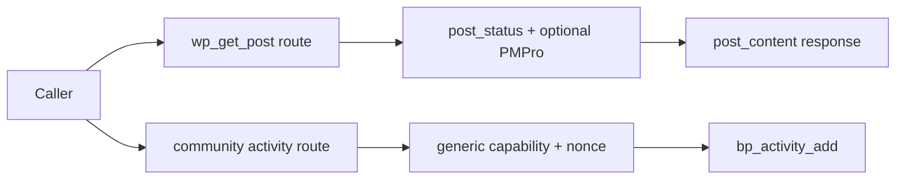
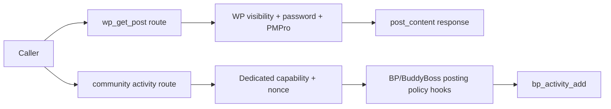
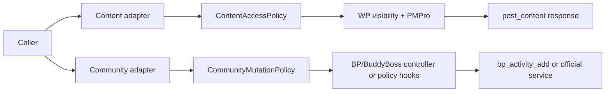

# Security Hardening Proposal: Domain-Owned Authorization Before Content And Community Sinks

## Decision

We should stop treating a generic WordPress capability as the final authorization decision for domain-specific content and community actions. I recommend Option 2, domain policy services, after Option 1's direct guards land. This makes WordPress visibility and BuddyPress/BuddyBoss posting policy explicit without forcing every adapter to know every host-plugin version detail.

## Executive Recommendation

**Option 1: Adapter-local domain guards** is the fastest safe release: check WordPress public visibility/password state and invoke the available BuddyPress posting permission hooks before the existing sinks. **Option 2: Domain policy services** creates `ContentAccessPolicy` and `CommunityMutationPolicy` interfaces so adapters delegate to one place and can evolve with PMPro/BuddyPress/BuddyBoss versions. Option 1 remains the fallback when integration fixtures are not ready; Option 2 is the recommended destination.

## Evidence

I inspected the post retrieval and community route definitions and their sinks.

| Evidence | Finding | What it establishes |
| --- | --- | --- |
| `csf_91129cebbfbb83383193d9e0` | `wp_get_post` bypasses WordPress visibility and password protections | `class-rest.php:318-346` returns content after only a `publish` status check. |
| `csf_014652bc75c27a165ce450a8` | BuddyPress activity creation bypasses BuddyPress posting authorization | `class-community.php:185-197,278-285` uses the generic gate and calls `bp_activity_add()` directly. |

## Current Design And Failure Mode

The content adapter uses PMPro access when the function exists, but otherwise treats a published post as public. That omits password and public-queryability checks. The community adapter requires login, nonce, and the configured WebMCP capability, then inserts activity directly. We infer that the plugin's generic capability is being used as a substitute for domain policy; whether `bp_activity_add()` adds equivalent checks depends on the deployed BuddyPress/BuddyBoss version and was not available in the source-only environment.

## Desired Invariants

- Content is returned only when WordPress considers the post publicly viewable, the password requirement is satisfied, and PMPro access permits it.
- Community publication requires the deployed BuddyPress/BuddyBoss posting, suspension, moderation, privacy, and site-policy checks.
- Mutation tools use a dedicated, configurable capability rather than defaulting to a broad read capability.
- Each integration exposes one policy hook that can be tested independently of the WebMCP transport.

## Constraints And Non-Goals

We will preserve response shapes, tool names, and PMPro paywall behavior. We are not replacing BuddyPress/BuddyBoss or inventing a parallel membership system. The exact controller/helper available in each supported version must be discovered in integration fixtures before the policy service is finalized.

## Before Architecture

The two sinks have different policy owners, but both currently rely on a generic adapter-level decision. That is why a normal WordPress password or a BuddyPress posting restriction can be skipped.

## Options

### Option 1: Adapter-Local Domain Guards

We would add `is_post_publicly_viewable()` and `post_password_required()` checks before the content response, enforce a public post-type policy, and add an explicit community mutation capability plus the available BuddyPress/BuddyBoss posting permission checks before `bp_activity_add()`. This is a small, reviewable change and preserves the current adapter structure.

| Change | Before | After | Security consequence | Cost |
| --- | --- | --- | --- | --- |
| Post access | `publish` implied public | WordPress visibility/password checks | Prevents protected-content disclosure | Small helper and test changes |
| Activity authorization | Generic `read` gate | Dedicated mutation capability plus BP policy | Narrows who can publish | Role migration and version checks |
| Policy ownership | Inline adapter conventions | Explicit checks beside each sink | Immediate protection, but future adapters can drift | Repeated local code |

The local option is appropriate for an urgent patch. We should be honest that it does not solve policy duplication across future integrations. Rollback is simple, but reverting the checks would reopen the findings.

### Option 2: Domain Policy Services

We would introduce small services such as `ContentAccessPolicy` and `CommunityMutationPolicy`. The REST and native adapters ask the service for a decision; the service composes WordPress core visibility, PMPro access, and the deployed BuddyPress/BuddyBoss controller or permission hooks. The service returns a stable allow/deny reason and leaves the existing response formatting and sinks intact.

| Change | Before | After | Security consequence | Cost |
| --- | --- | --- | --- | --- |
| Content policy | Inline status/PMPro checks | One tested policy service | Consistent visibility across transports | New interface and fixtures |
| Community policy | Direct generic gate and insert | Version-aware policy service | Domain restrictions become mandatory | Integration maintenance |
| Future adapters | Each adapter invents checks | Adapter delegates to a policy owner | Lower recurrence and easier review | More upfront design |

The service boundary is attractive because it lets us test policy decisions without a REST request and lets integrations adapt to BuddyPress/BuddyBoss versions. The concern is false confidence: a service that merely wraps `bp_activity_add()` without invoking the real permission path would add structure but no security. We should require fixtures proving blocked, suspended, posting-disabled, and private-community cases before enabling the structural path.

## Comparison

| Dimension | Option 1: Local guards | Option 2: Policy services |
| --- | --- | --- |
| Security | Directly closes known paths | Closes paths and makes domain ownership reusable |
| Performance | Minimal extra calls | One policy call; may invoke host-plugin checks |
| Memory | Negligible | Small policy objects/context per request |
| Reliability | Lower migration risk | Better consistency, but version adapters need coverage |
| Operability | Existing logs | Standard allow/deny reasons and integration telemetry |
| Migration | Immediate patch and role review | Staged service introduction and fixture matrix |

## Recommendation

I recommend Option 2 once we have a configured integration matrix; until then, ship Option 1 as the safety gate. Option 1 should win if the plugin must release before BuddyPress/BuddyBoss versions can be exercised. Option 2 becomes non-negotiable when a third domain adapter or a second transport is added, because repeated local guards will otherwise recreate the same authorization drift.

## Evidence Coverage And Residual Risk

| Finding | Effect | Tactical work still required |
| --- | --- | --- |
| `csf_91129cebbfbb83383193d9e0` — Post visibility bypass | Addresses | Yes, add WordPress visibility/password checks before service migration. |
| `csf_014652bc75c27a165ce450a8` — BuddyPress posting bypass | Addresses | Yes, select and test the deployed BP/BuddyBoss permission path. |

Residual risk remains for custom post types, PMPro content filters, and BuddyPress/BuddyBoss plugins that alter permissions through hooks. The policy service must fail closed when a required domain permission function is unavailable rather than silently treating the generic capability as sufficient.

## Migration And Rollout

First add the direct content guards and dedicated community capability. Then introduce policy services behind the same public tool callbacks, emit allow/deny reason metrics, and migrate one integration at a time. During rollout, compare service decisions with current behavior in staging. Roll back by keeping the direct guards and disabling the service adapter, never by restoring the old generic-only path.

## Validation Plan

- Exercise public, password-protected, private, custom post-type, and PMPro-controlled posts.
- Test BuddyPress/BuddyBoss posting-disabled, suspended, moderated, private, and normal users.
- Compare REST and native ability decisions for the same resource and user.
- Verify dedicated capability assignments for administrator, editor, member, and anonymous roles.
- Add fail-closed tests when PMPro or BuddyPress/BuddyBoss APIs are absent or return an error.

## Implementation Work Packages

1. Define policy result objects and stable deny reasons.
2. Add WordPress visibility/password/type checks to content retrieval.
3. Add a dedicated, configurable community mutation capability.
4. Implement the deployed BuddyPress/BuddyBoss permission adapter and fixtures.
5. Extract `ContentAccessPolicy` and `CommunityMutationPolicy` behind existing callbacks.
6. Add REST/native parity tests and document integration-version requirements.

## Open Questions

- Which BuddyPress/BuddyBoss versions and policy hooks are supported targets?
- Should `wp_get_post` allow any custom post type or only an explicit public allowlist?
- What is the desired default capability for community activity publication on existing installations?

