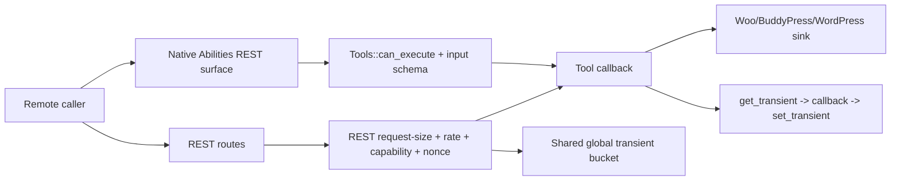
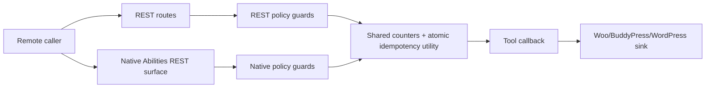
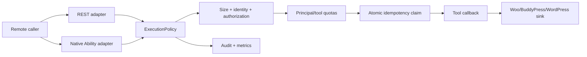

# Security Hardening Proposal: One Policy Boundary for REST and Native Execution

## Decision

We need one owned execution boundary for every WebMCP tool invocation. I recommend Option 2, introduced behind Option 1's tactical protections. This preserves the current REST contracts while preventing native Abilities and future adapters from bypassing request, identity, quota, idempotency, and audit controls.

## Executive Recommendation

We have two serious choices. **Option 1: Local guards and a shared atomic utility** keeps the current structure and closes the observed paths quickly. **Option 2: Unified execution policy** introduces one `ExecutionPolicy` wrapper used by both REST and native Abilities; it is the recommended destination because the findings are different symptoms of duplicated control ownership. Option 1 should be the first release gate even if we commit to Option 2, so the vulnerable paths are protected while the abstraction is built.

## Evidence

I inspected the REST permission path, native ability registration, rate-limit implementation, and mutation wrappers.

| Evidence | Finding | What it establishes |
| --- | --- | --- |
| `csf_efc629ac65c7d03cc8d6a47f` | Native WordPress Abilities bypass WebMCP rate and request-size controls | `class-tools.php:164-215` calls the tool callback directly after capability/input checks. |
| `csf_973adf337076f4752f904952` | Global REST rate limit is remotely exhaustible before authentication | `class-rest.php:201-215,258-269` charges one global bucket before authorization. |
| `csf_8a400003aa21945f7d5ff023` | Idempotency protection is non-atomic and allows duplicate mutations | `class-rest.php:128-156` writes the replay record only after the mutation finishes. |

## Current Design And Failure Mode

The REST route has request-size, rate, capability, and nonce checks, while native Abilities use `Tools::can_execute()` and call the registered callback directly. Mutations then use a transient response cache that is claimed only after the callback returns. We can therefore reach the same sink through two policy paths, and the shared global bucket can be consumed before authentication. The source supports this diagnosis; the exact native REST exposure and cache atomicity still need runtime confirmation.

## Desired Invariants

- Every REST and native ability invocation passes through the same request-size, identity, authorization, quota, audit, and dispatch policy.
- Anonymous and authenticated budgets are isolated by principal and tool; failed authorization does not consume the authenticated budget.
- An idempotency key is atomically claimed before a mutation begins, with an explicit in-progress state and request fingerprint.
- Native mutation Abilities remain disabled unless an integration explicitly supplies an equivalent confirmation and authorization policy.

## Constraints And Non-Goals

We are not introducing a separate service, changing tool names, or redesigning the WebMCP browser protocol. We will keep the current REST response shapes and preserve the opt-in native mutation filter. Performance effects are unmeasured; we will benchmark before changing defaults.

## Before Architecture

The important boundary is that `RP` and `NP` are not equivalent, while `I` claims idempotency after the side effect. The result is policy drift rather than a single exploitable function.

## Options

### Option 1: Local Guards And Shared Atomic Utility

We would add request-size and rate checks to native ability execution, move REST rate charging into a principal-aware policy order, and replace the idempotency read/execute/write sequence with an atomic cache/database claim. A small shared utility can provide atomic counters and idempotency records without changing the broader registry model.

This is attractive when we need a fast release and want a small diff. It directly addresses all three findings and keeps existing callbacks familiar. The concern is recurrence: each future entry point still has to remember to invoke the utility, and a missed call recreates the same class of problem.

| Change | Before | After | Security consequence | Cost |
| --- | --- | --- | --- | --- |
| Native controls | Native path skipped REST controls | Native wrapper invokes the same checks | Removes the direct bypass | Duplicate wrapper calls remain |
| Quotas | One pre-auth global bucket | Principal/tool buckets with anonymous isolation | Limits cross-user exhaustion | More transient keys and telemetry |
| Idempotency | Post-execution response cache | Atomic claim before callback | Prevents concurrent duplicate mutations | Cache/database coordination |

The likely performance cost is one extra cache operation per request and one atomic claim for idempotent mutations. We should measure request latency, transient operations, and 429 fairness under concurrent load. Rollback is a focused revert, but the old non-atomic helper must not be restored while any caller relies on duplicate suppression.

### Option 2: Unified Execution Policy

We would introduce a plugin-owned `ExecutionPolicy` (or equivalent) that accepts a normalized tool invocation and returns either a policy failure or a dispatch result. REST routes and native Abilities become thin adapters. The policy orders size validation, identity resolution, tool capability, anonymous/authenticated quota, nonce/host authorization where applicable, atomic idempotency, callback dispatch, and audit. Native mutations remain rejected unless the integration supplies an explicit policy extension.

This is the stronger boundary because adding an entry point no longer requires reimplementing every control. We pay a larger refactor and must preserve WordPress REST error semantics, but the control ownership becomes visible and testable. I recommend this option under the current balanced constraints; Option 1 becomes preferable if the next release cannot absorb a new policy abstraction.

| Change | Before | After | Security consequence | Cost |
| --- | --- | --- | --- | --- |
| Control ownership | REST and native paths diverged | One policy owns the sequence | New entry points inherit controls by construction | Refactor and compatibility tests |
| Authorization order | Global rate before capability | Identity-aware policy chooses budget and authorization order | Failed or anonymous traffic cannot starve authorized callers | More policy state and metrics |
| Idempotency | Cache written after side effect | Atomic claim and in-progress state precede dispatch | Duplicate mutations become a rejected/waited state | Atomic cache/database dependency |

The main reliability risk is an incorrect adapter migration that changes status codes or callback context. We should retain the existing callbacks, move them behind the policy, and compare REST/native responses in compatibility tests. We can roll back adapter registration to the old route wrappers only after restoring the tactical guards, not the vulnerable direct paths.

## Comparison

| Dimension | Option 1: Local guards | Option 2: Unified policy |
| --- | --- | --- |
| Security | Addresses observed paths; future drift remains possible | Makes the shared invariant structurally explicit |
| Performance | Small per-request utility overhead | Similar runtime path, plus policy normalization |
| Memory | Few additional transient records | Policy context and atomic records; bounded per request |
| Reliability | Lower migration risk, higher recurrence risk | Higher migration risk, clearer failure containment |
| Operability | Existing logs plus new counters | Central metrics and policy decision reasons |
| Migration | Small release-sized patch | Two-phase adapter refactor and contract tests |

## Recommendation

I recommend Option 2 as the target design, with Option 1's atomic idempotency and quota isolation shipped first. We should choose Option 1 alone if compatibility testing cannot be completed before the release window. A production finding that native Abilities are not exposed would lower the urgency of the native adapter work, but it would not remove the value of one policy boundary for future integrations.

## Evidence Coverage And Residual Risk

| Finding | Effect | Tactical work still required |
| --- | --- | --- |
| `csf_efc629ac65c7d03cc8d6a47f` — Native Abilities control bypass | Addresses | Yes, until both adapters use `ExecutionPolicy`. |
| `csf_973adf337076f4752f904952` — Pre-auth global limiter | Addresses | Yes, partition budgets and move authorization-aware charging. |
| `csf_8a400003aa21945f7d5ff023` — Idempotency race | Addresses | Yes, deploy atomic claim before enabling concurrent mutation tests. |

Residual risk remains if a host-provided native endpoint bypasses the plugin entirely, if the object cache does not support atomic add semantics, or if an integration opts into native mutation without a confirmation equivalent. Those conditions belong in deployment checks.

## Migration And Rollout

We should ship the atomic idempotency utility and principal-aware quotas first, then add the native adapter wrapper behind a feature flag, and finally make `ExecutionPolicy` the only supported registration path. During migration, retain the old REST route names and log whether calls used the legacy or policy path. Roll back by disabling the new adapter registration and retaining the tactical guards.

## Validation Plan

- Run REST and native ability requests through the same fixture and compare status, response body, capability, and audit output.
- Send concurrent identical mutation requests and assert exactly one callback execution and one replay/in-progress response.
- Exhaust an anonymous bucket and verify an authenticated principal retains its reserved budget.
- Fuzz request size and schema inputs through both entry points.
- Benchmark p50/p95 latency, transient operations, and peak PHP memory before and after policy adoption.

## Implementation Work Packages

1. Define a normalized invocation context and policy result/error contract.
2. Implement atomic idempotency claim/replay/in-progress states with a safe fallback when no atomic cache primitive exists.
3. Implement principal/tool quotas and authorization-aware charging.
4. Route REST adapters through the policy without changing public paths.
5. Route native Abilities through the policy and keep native mutation opt-in.
6. Add compatibility, concurrency, abuse, and benchmark tests.

## Open Questions

- Is the production object cache atomic for `add`/increment operations?
- Which WordPress versions need to remain compatible with the native adapter code?
- Should anonymous requests receive a separate lower budget or be disabled for selected tools?

